# Preparação de ambiente
Criar uma máquina virtual para instalar as ferramentas e dependências para o 
estudo de algoritmo e lógica de programação

## Criar o diretório base
Vamos criar um diretório para guardar a nossa máquina virutal. Será criado no 
Drive D. Nomeada com o nome do usuário.

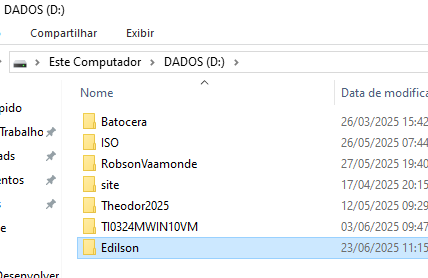

## Preparação da máquina virtual
### Vamos usar a ferramenta de virtualização chamada Virutal Box

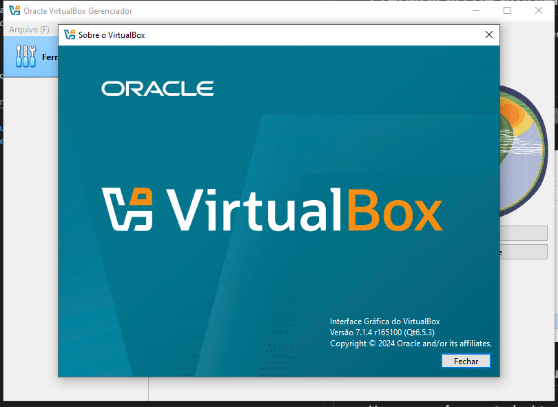

<a href="https://www.virtualbox.org/wiki/Downloads"> Faça o download aqui </a>


## Criando a máquina virtual

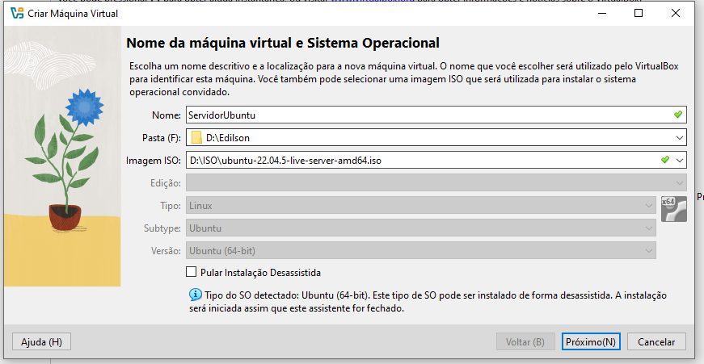

## Configuração da máquina virtual

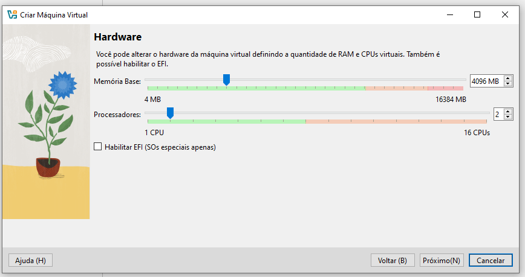

## Configuração do disco

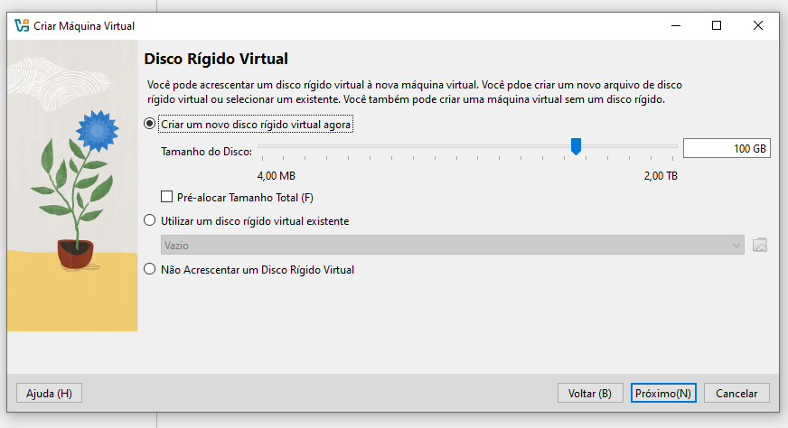

## Resumo da Instalação

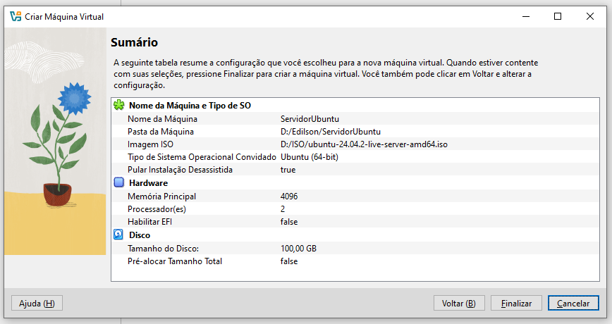

## Iniciando a instalação 
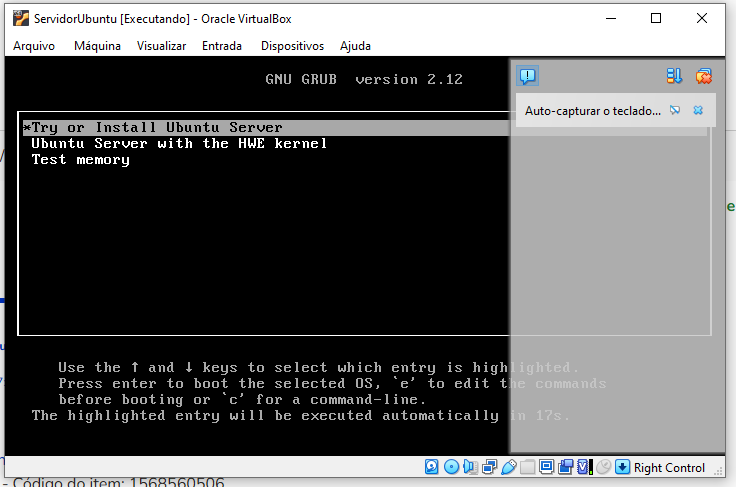

## Configurar idioma e teclado

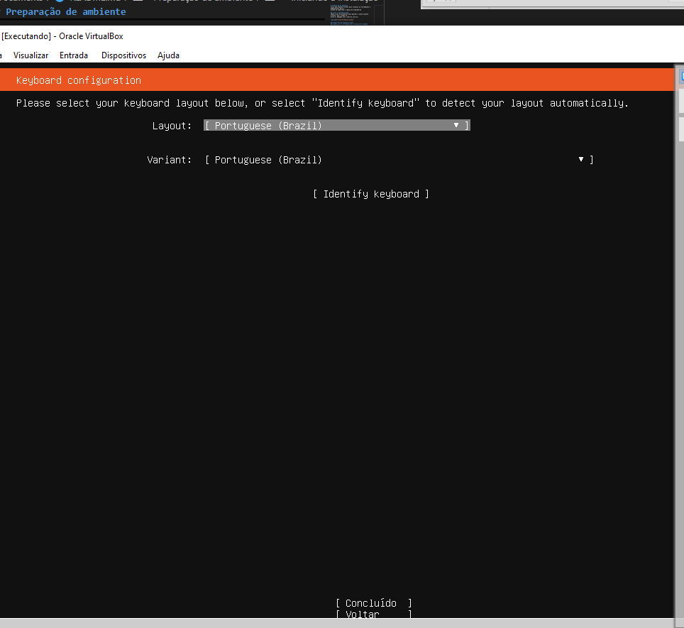

## Resumo da configuração Ubuntu

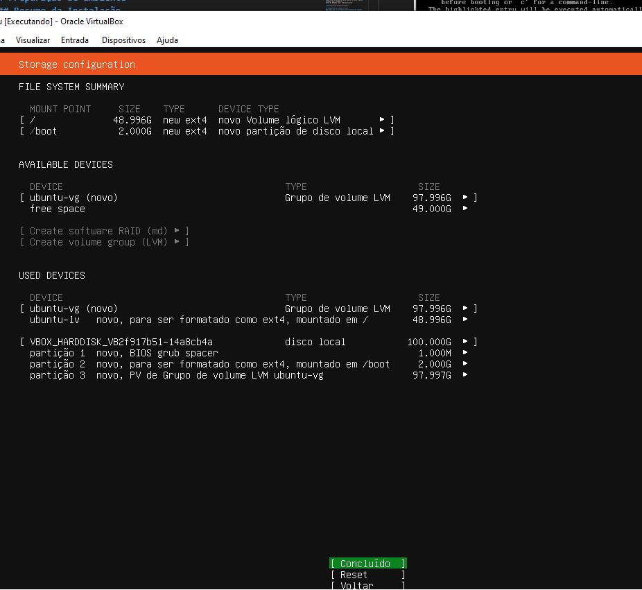

## Configuração usuário

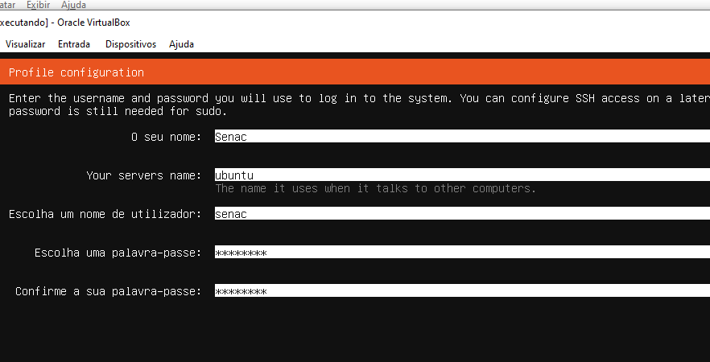

## Pós instalação:

Para atualizar o sistema iremos usar os seguintes comandos:

```shell
sudo apt update -y
```

```shell
sudo apt upgrade -y
``` 

ou

```shell
sudo apt update -y && sudo apt upgrade -y 
```

## Intalação do cockpit

Ferramenta para gerenciar o servidor, por meio de um 
ambinte grafico online

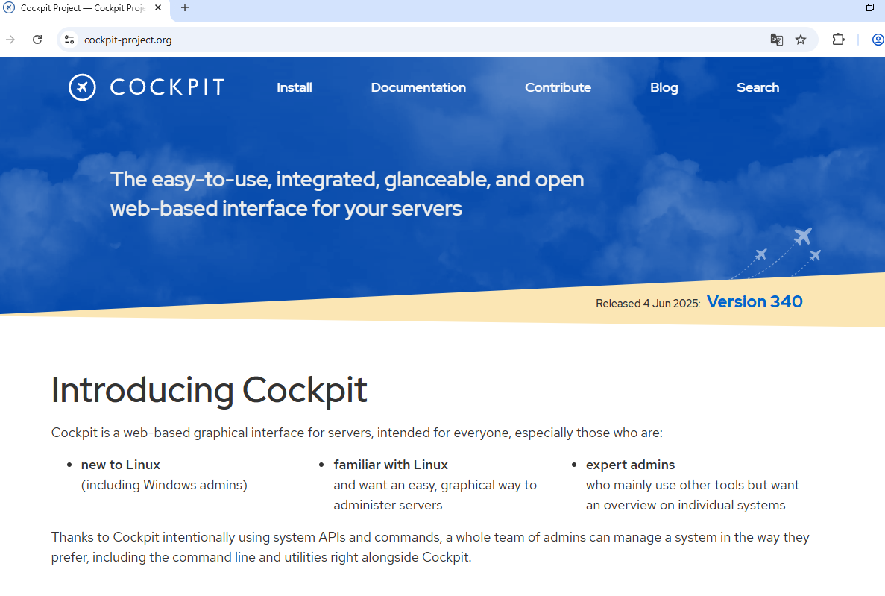

#### comando para instalar o cockpit

```shell
sudo apt install cockpit -y
```